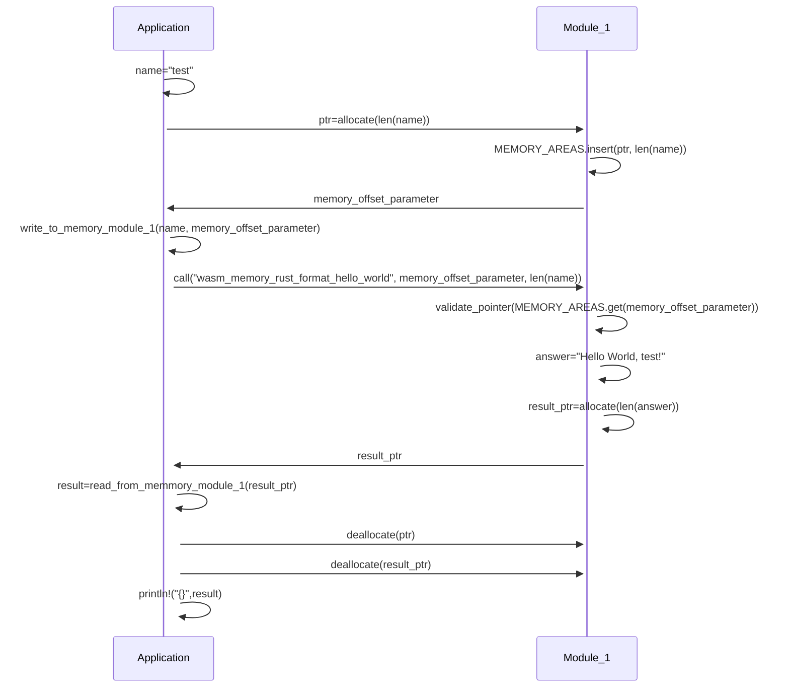

# Introduction
State: 16.07.2022

**NOTE: THIS EXAMPLE IS FOR DEMONSTRATION ONLY - DO NOT USE FOR PRODUCTION APPLICATIONS**

This is a small example to use Rust for an application to load dynamically another application module targetting wasm32-wasi. This target enables compilation to [Webassembly](https://webassembly.org/) (WASM). Originally WASM was a framework for secure near-native speed browser applications, it has been extended in the past to serve the needs of all types of cross-platform secure near-native applications, such as server-based or serverless ones. See also this [blog post](https://zuinnote.eu/blog/?p=1567) to find out more on the WASM ecosystem.

The study contributes to [Zu Stateful Data Pipelines (ZuStDPipe)](https://codeberg.org/ZuInnoTe/zustdpipe) - a highly modular secure stateful data pipeline engine for all types of platforms. Since modularity is core concept of this engine, it is crucial to assess the different possibilities to realize modularity (see also [here](https://zuinnote.eu/blog/?p=540)). The outcomes should be interpreted towards the use case of ZuSearch and not be generalized.

Rust was selected as the language to write the highly modular search engine and most of its modules. However, third party modules could also be written in other languages.

Furthermore, the core engine is extremely lightweight - ideally it loads only modules in a secure way, but all other aspects that the user/developer needs are loaded dynamically from modules. 

All those aspects can be summarized as follows:
* Core engine written in Rust that can be extended with modules written in (nearly) any language
* Cross-plattform support
* Modules can be loaded dynamically based on a need basis
* Modules can be load securely - this means all interactions happen through precise interfaces, clear memory separation (no rouge module can bring down the whole application) and we can define additional policies what a module is allowed to do and what not (e.g. access to filesystem)
* There are potential large data volumes to be exchanged between modules - it is not only about parameters and some return values
## Blog
Find additional considerations in [this blog post](https://zuinnote.eu/blog/?p=2037).
## Code
The code is available under:
* Codeberg (a non-commercial European hosted Git for Open Source): https://codeberg.org/ZuInnoTe/rust-wasm-dynamic-module-study
* Github (an US hosted commercial Git platform): https://github.com/ZuInnoTe/rust-wasm-dynamic-module-study

## License
You can choose to either use [EUPL-1.2](./LICENSE-EUPL-1.2) ([Web](https://spdx.org/licenses/EUPL-1.2.html)) or [Apache-2.0](./LICENSE-Apache-2.0) ([Web](https://spdx.org/licenses/Apache-2.0.html)) license.

# Technology Choices
This is just a brief overview on the potential technology choices - it is not complete (raise an issue if you think some consideration is missing!). I will link later a more detailed justification. The following choices were there:
* Use Rust dylib: Precise interfaces are possible, but the future/current state of dylib is [rather unclear](https://rust-lang.github.io/rfcs/1510-cdylib.html) - I found hardly any application (beyond examples) that use it (for this reason). Furthermore, there is no standardized Rust Appplication Binary Interface (ABI) (see [here](https://github.com/slightknack/rust-abi-wiki) for a Wiki summarizing the issues) - this means there is no support for other languages. Additionally, even within Rust it can lead to incompatibilities between different Rust versions. Cross-platform is possible, but one has to create dedicated binaries for each platform making it more complicated to ensure all modules for a given installation belong to the same platform, one has to ask module providers to compile for different target etc. Since multiple platforms (e.g. x86_64, arm64, specific processors for embedded etc.) are nowadays the reality, this is challenging. It might not be so efficient for massive data exchange between modules of different languages.
* Use [Rust cdylib](https://doc.rust-lang.org/nomicon/ffi.html): This is the most common way to load dynamic libraries. Libraries can be loaded through the well-established C ABI (there is NO standard for the C ABI - it somehow evolved over years to sth. standard-like due to adaption), which is supported in virtually any programming language. Cross-platform is possible, but with the same issues as for Rust dylib. It might not be so efficient for massive data exchange between modules written in different languages.
* Use [WebAssembly](https://en.wikipedia.org/wiki/WebAssembly) (WASM): This a newer way gaining a lot of popularity. All modules are compiled to WASM and can be dynamically loaded. It is an [established standard](https://webassembly.org/) supported in popular browsers and many different operating systems. Many programming languages can compile to WASM. Most of the runtimes provide also permission management (e.g. on the filesystem and network level). One does not need different binaries for each platform - it is the same binary across all platforms. There is a clear separation of memory between application and modules. Most of the WASM runtimes have a capabilities/permission model through WASI (see [here](https://github.com/bytecodealliance/wasmtime/blob/main/docs/WASI-capabilities.md)) enabling defining security policies around modules. For instance, one can define a policy that module A is not allowed to access the network, but local storage. Module B is allowed to access the network, but not local storage. Complex datatypes, such as strings, array or lists are not standardized, but one can use Apache Arrow to serialize data that can be analyzed by modules written in different languages very efficiently.


Note: the [C++ ABI](https://gcc.gnu.org/onlinedocs/libstdc++/manual/abi.html) - has a similar issue as the Rust ABI - it is not widely used and similar to the C ABI also not standardized. 


While WASM is the final choice, because it fits all criteria of the use case, there are still some aspects yet missing to fit the use case of ZuSearch:
* 64-Bit memory - large scale search applications - especially with a lot of documents and/or machine learning augmented search - require a lot of memory. Currently, only 32-bit of memory are supported, but the standardization of 64-bit memory is on its way (see [here](https://github.com/WebAssembly/memory64/blob/main/proposals/memory64/Overview.md)). Nevertheless, since each module can have up to 4 GB and each thread can instantiate their own module this might be not as limiting as one might think, but it limits more flexibility/practicality.
* Threads (see [here](https://github.com/WebAssembly/threads/blob/master/proposals/threads/Overview.md) for the proposal)- This is mainly for the main application that will create threads and instantiate from those threads individual WASM modules. However, also within one module one may want to have multiple threads, e.g. for machine learning applications.
* Multi-Memory (see [here](https://github.com/WebAssembly/multi-memory/blob/main/proposals/multi-memory/Overview.md)) provides multiple independent memory areas for a WASM module. This is especially relevant for our use case to increase safety as well as security for the data exchange between application and module. Currently, if the application or the module contains a bug, the application could accidently write into the wrong part of the memory leading to malfunctioning of the module.
* Component model - especially WASM Interface Types (WIT). At the moment, an application can only share with a module a common memory ("Store") or simple integer parameters. However, ZuSearch likely will involve complex interfaces with different basic types (e.g. strings) or complex structures (e.g. arrays, structs etc.). While they can be handed over in memory - there is no standard on how a string or structure looks like and every programming language represents them differently. A standard can help here to reduce the development efforts especially in differrent programming languages. Instead of WIT and given the use case of ZuSearch of large data, [Arrow](https://github.com/apache/arrow-rs) might be a more suitable alternative than WIT. See [here](https://github.com/WebAssembly/component-model) for the standardization and [here](https://radu-matei.com/blog/intro-wasm-components/) for a blog describing more practical aspects. 
* Exception handling - exceptions do not currently interrupt execution of the application and/or module. See [here](https://github.com/WebAssembly/exception-handling/blob/master/proposals/exception-handling/Exceptions.md) for the standardization
* Module repository. Many programming languages have module repositories (e.g. Maven Central for Java, Pypi for Python, NPM for Javascript/Typescript etc.) that include (binary/transpiled etc.) version of the modules to be loaded by an application (usually at compile time, but also at runtime). The way to access them is standardized. WASM has no standard for module repositories, but there are multiple competing once (see e.g. this [blog post](https://zuinnote.eu/blog/?p=1567)). The usage of module repositories in WASM is still in its infancy.
* Permission/Capability model in WASI is still work-in-progress and expected to be significantly enhanced.

Fortunately, those are are addressed or being addressed (see also [WebAssembly Roadmap](https://webassembly.org/roadmap/) or [active WebAssembly Proposals](https://github.com/WebAssembly/proposals)). They do not block the further development of ZuSearch if not yet fully available. Nevertheless, the core assumption is that they become available eventually to realize all benefits and requirements of the use case.

# Runtime choices

There are a lot of runtimes (see e.g. this [blog post](https://zuinnote.eu/blog/?p=1567)). We use in this example [wasmtime](https://wasmtime.dev/), but any of the other ones supporting Rust (e.g. [Wasmer](https://wasmer.io/)) would have worked as well.

We integrate the runtimes as a dependency in the application. The application itself is currently compiled to a native platform (e.g. x86_64). It is unclear if also the application can be compiled to WASM in the future. However, since it will have anyway a minimal functionality and most of the functionality exists in the WASM modules, this is less critical.


# Exchange of data between application and modules
A crucial part is how the application and the modules exchange data via the shared memory as the WASM component model is currently not standardized. We look at the following aspects:
* Exchange via C types (via the established C ABI). Usually many programming languages have support for this, but it expects from the developer a lot of "boilerplate" code. Furthermore, it is slow especially due the frequent (de-)serialization of data when moving data between modules of different programming languages.
* Exchange via Rust types. While other programming languages can read any data, the processing of Rust datatypes in other programming languages needs dedicated implementations, which do not exist out of the box. Similarly to C types a lot of boilerplate code is required. Furthermore, it is slow especially due the frequent (de-)serialization of data when moving data between modules of different programming languages.
* Exchange via [Apache Arrow](https://arrow.apache.org/overview/). Apache Arrow is an in-memory analytics format that can be read in many different programming languages and is mostly for tabular data. While this is less useful for standard module integration (functions with different parameters, returning value(s)), it can be very useful for the case of ZuSearch where different modules potentially written in different programming languages need to process data. Additionally, frequent (de-)serialization is not needed, because all programming languages can work directly on the data in Arrow format. In a later stage, ZuSearch may also involve working in a distributed cluster, which could be facilitated by using [arrow-flight](https://arrow.apache.org/blog/2019/10/13/introducing-arrow-flight/). Hence, it is the mechanism of choice when working with different modules. It is probably the better choice compared to the upcoming WebAssembly Types for this specific use case of massive data processing.
  * Note: Rust arrow needs to use to_raw() so other programming language can use the Arrow data.


# Study
The study here is a very simple application written in Rust that loads dynamically a module written in Rust compiled to WASM:
* [wasm-app](./wasm-app/) - the main application that 
  * loads dynamically the functions in module1 with a parameter string and get a string as return
  * loads dynamically the function in module2 with data in Arrow IPC serialization format ands gets some data in Arrow IPC serialization format back
* [wasm-module1](./wasm-module1/) - an example module that has one function with a parameter name that returns the string "Hello World, Name!".
  * Covers exchange via C ABI types and Rust ABI types
  * C ABI is with a parameter pointer to a CString in the WASM module memory containing the name. Return is a pointer in the WASM module memory containing the greeting as a CString
  * Rust ABI is with two parameters: A pointer to the Rust String in the WASM module memory containing the name AND the length of the string. Return is a pointer in the WASM module memory containing another pointer and length of the string. Reason is that contrary to C strings, Rust strings are not ended by \0. 
* [wasm-module2](./wasm-module2/) - an example module that has a functions with two parameters: a pointer to serialized data in Arrow IPC format and the size of the serializeed data. Return is a pointer n the WASM module memory to the processed serialized data by the function in Arrow IPC format and the size of the serialized data. We can implement in Arrow mandatory attributes of a document (e.g. id etc.) and also more flexible dictionaries by having an Array of the struct(key,value), e.g. [{key: "category",value:"news"}]


We compile in Rust the module to the target "wasm32-wasip1" (see [here](https://dev-doc.rust-lang.org/stable/rustc/platform-support/wasm32-wasip1.html)).

Note: We also link the WASI modules dynamically into the module. However, WASI is still experimental and standardization not finalized. We could also circumwent the use of WASI (e.g. by not relying on std etc.), but since WASI will anyway be needed for the use case of ZuStdPipe (e.g. file, network accesss as well as corresponding permissions) we included it also in the study.

## Flow to exchange data between the application and the modules
Currently, each WASM module is loaded into a memory. The application calling the module can write to this memory to exchange data with the module. The problem is that the application does not know where it can write the data. Hence, each module - as our examples - need to provide a function to the application ("allocate") that returns an area where it can safely write data. Additionally, the module needs also to provide a function that frees the data ("deallocate") after the application has finished processing the results of a function call.

Note: Once Multi-Memory is supported by WASM you should exchange data via dedicated memories for paramater exchange: one for parameters from the application to the module and another one from the module to the application. You will still need allocation functions (that are application internal and not module internal), so that in case of multi-threading the threads do not overwrite each others data. 

Find here an illustration of the current situation (only one memory for the module is possible and it is shared with the application) using the steps as pseudocode.



This is a lot of code for simply calling a function of the module with a name ("test") that returns a greeting as string ("Hello World, Test!") that is then printed to the console by the application. Some important aspects:
* The application needs to request from the module a free memory area in the shared memory to store the parameter (e.g. "test")
* The application needs to write the string in a format (see discussion above on ABIs and Arrow serialization) that the module understands to the allocated shared memory areas
* The Module also needs to reserve an area in the memory to store its answer and send the pointer to this answer in the shared memory to the application
* The application needs to read the answer from the shared memory
* The application needs to explicitly call the deallocate function of the module to release the memory for the parameter and the result - otherwise the shared memory area fill be filled with data that is not needed anymore
* The application prints out the result to the console

The concept works for the exchange of Arrow serialized data similarly. In this case module_2 processes the data in Arrow IPC format provided by the application.
# Build and run
You can build the modules by executing the following command in their folder:
```
cargo build --release --target wasm32-wasip1
```

The reason for building a release is that otherwise the module2 containing a wasi runtime and the Arrow library becomes very large and loading it in the application takes ages.

You can build the application by running the following command:
```
cargo build
```

You can then run the application by executing target/debug/wasm-app

Note: The application itself is not compiled to WASM. This is at the moment not possible (e.g. lack of thread support in WASM etc.), but is of lesser relevance for now for the study and also because it will have minimal functionality itself and all the functionality is implemented by modules.


# Observations

* The application cannot be compiled to wasm32-wasip1 yet (although desired for the future to leverage WASM also in the ZuSearch core), because wasmtime or more specifically WASI does not seem to support this yet.
* The modules can be compiled to wasm32-wasip1 and loaded by the application.
* We use cdylib annoation to create the WASM, but cdylib itself is not needed - this is needed because the WASM Interface Type (WIT), ie the WASM component model is not yet fully specified and implemented
* Including the wasmtime runtime in the application leads to a larger single binary (ca. 14 MB wasmtime 0.38.1 compiled as release). While the size is not very large, it limits the type of embedded device where to deploy it. However, the use case of ZuSearch also does not justify to embed it on any device (e.g. Arduino would be out of scope).
* While there is a WASM Component Example (cf. [here](https://github.com/radu-matei/wasm-components-example)) - it only describes static linking at compile time and it is unclear yet if this works at runtime as well. As mentioned, for our use case probably exchanging data via Arrow is the better choice in any case and we can do it already now.
* One needs to exchange data via a shared memory with the module. While this is possible, the module needs to validate the data in the [shared memory](https://docs.rs/wasmtime/0.38.1/wasmtime/struct.Memory.html) for correctness and the application needs to also check that returned data is correct. Especially one needs to make sure that no memory out-of-bound is accessed, shared memory is very short-lived, memory operations are atomic and that multiple threads do not overwrite each others data.  For the latter case it might be best that each thread instantiate its own module. Finally, one needs to take care that the memory is converted to programming-language specific datatypes, which will be cumbersome to support, if one does not use Apache Arrow or similar.
  * We covered in the study different ways on exchanging data between the app and memory
  * It is not clear if the WASM component model interface types bring any advantage over using Apache Arrow for exchange as the WASM component model interface types is merely for calling functions with parameters and return values. Especially since for the case of ZuSearch, we do not have necessarily complex module interfaces, but the main focus is (large) data processing.
* Each module will have to provide an allocate function, so that one does not write arbitrarily in the modules working memory
* Apache Arrow seems to increase the module size 2x in release mode (4 instead of 2 MB)
* You need to compile the modules and the app with the flag --release to have the right performance
* If we exchange a lot of data between modules, one should avoid to return a copy of the data with some modification as this always implies at least have double of the memory size. For example let us assume you have the data ```{"doc1": {title: "test", cotent:"this is a test"}, "doc2": {title: "spare thing", cotent:"this is a spare part"}``` and you have a function that replaces all occureances of "part" with "piece" then the function would still return the full data, ie including doc1 and the title of doc2, although they are not modified at all. Here one may better replace the data in-place (maybe with some indicator if it has changed and the new size of the data).
* The shared memory might need to grow and this is not automatic - it has to be initiated, ie one needs to check if the data to be written still fits into the memory - a simple and clear function need to be written for this. While this is not an issue with rather standard WASM modules, it will be for the use case of ZuSearch as often the default page size might not be sufficient. The default page seems to be somehow standardized (?) around 64 KB (see [here](https://docs.rs/wasmtime-environ/latest/wasmtime_environ/constant.WASM_PAGE_SIZE.html) for wasmtime), but may be different in certain scenarios.
* There is some inherent memory safety of the shared memory, e.g. one cannot read more then what is available and with a clear separation of memory of different modules (and/or different threads of the same module) one can avoid that they read/write in each memory. Also the modules cannot write into the application memory (*unless a callback is imported by the application that allows to write into memory in an unsafe way)
 * One needs to check the number of modules etc. to avoid that unncessary memory is allocated to them, ie do load everything in memory and then process, but more lightweight (load chunks into memory and process)
 * Modules might need to request memory themselves from the application calling them to store potentially additional data due to the transformations they do on the input data (e.g. in case of zusearch replacing in a text > 64 KB certain values). Again, this should be avoid as much as possible, a maximum memory limit / module / instance should be configurable. The system itself should be designed to stream data through modules, avoid conversion steps and reducing memory usage.